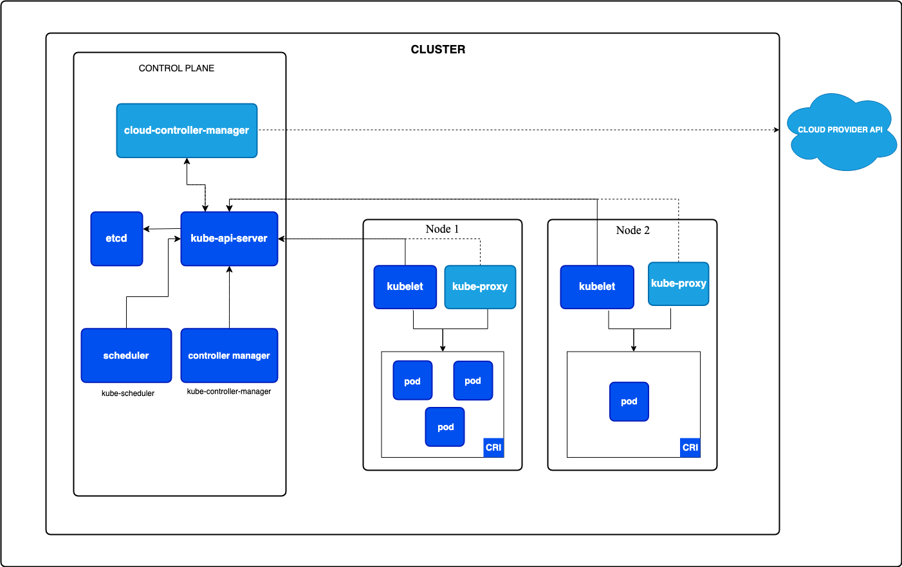
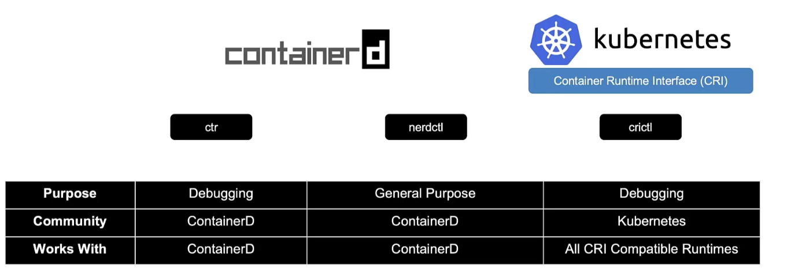

#### [Official Kubernetes documentation](https://kubernetes.io/docs/concepts/architecture/)

!!! note
    The `crictl` is from the Kubernetes community and works across all CRI compatible runtimes and are used mainly for debugging purposes.
    #### Available CRI's - `ContainerD`, `🚀rkt`
    

### Watch the Video
<iframe width="720" height="400" src="https://www.youtube.com/embed/TlHvYWVUZyc" frameborder="0" allowfullscreen></iframe>
