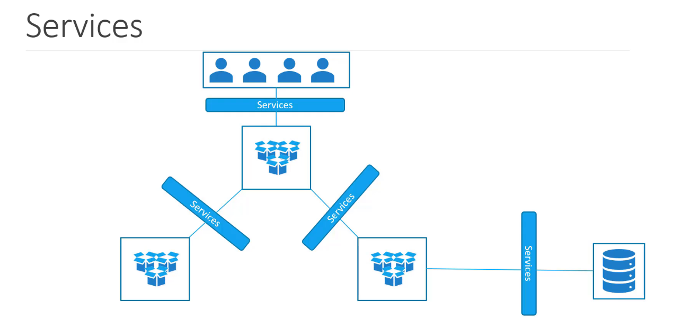
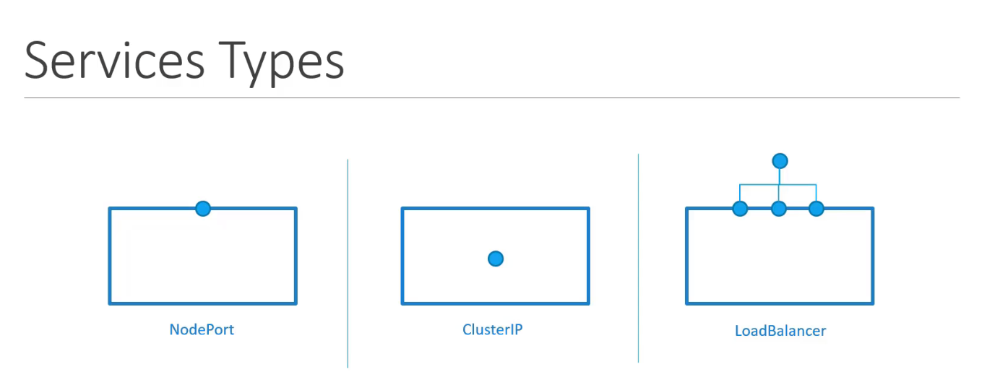
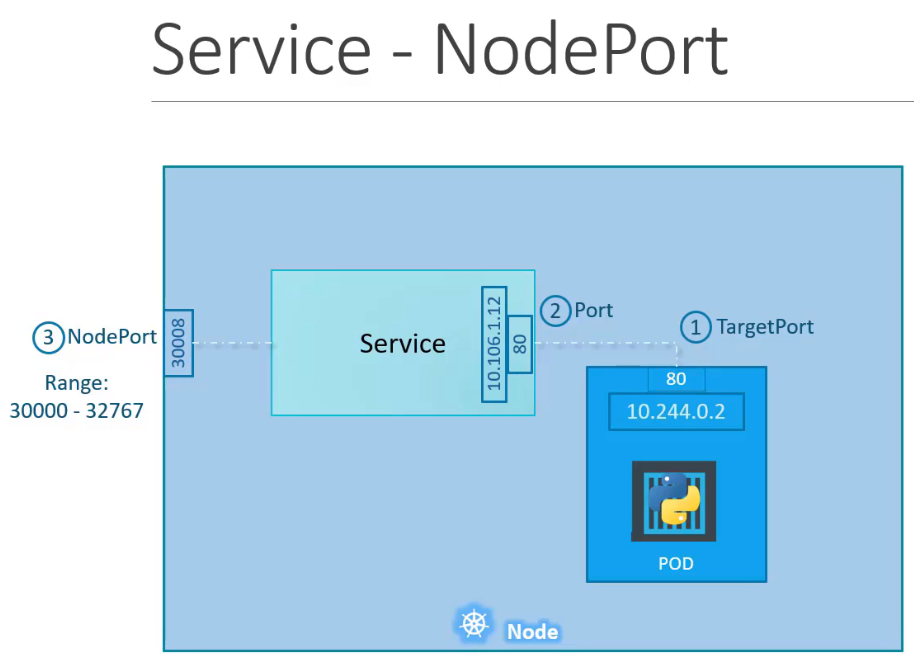
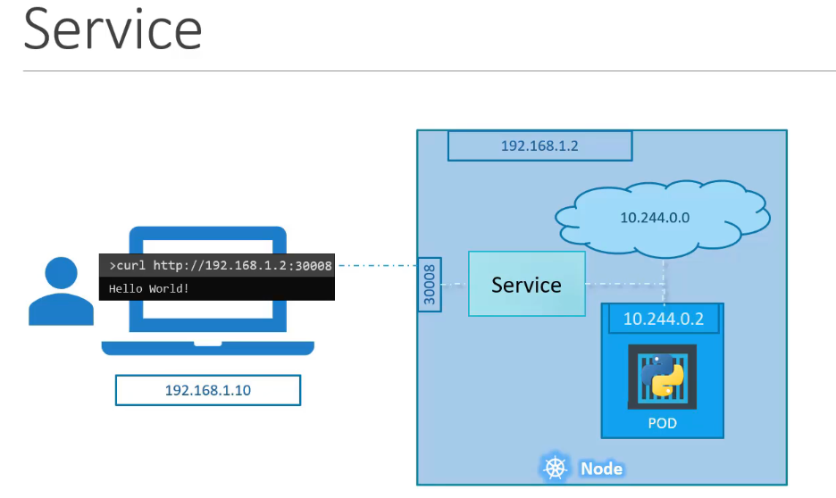
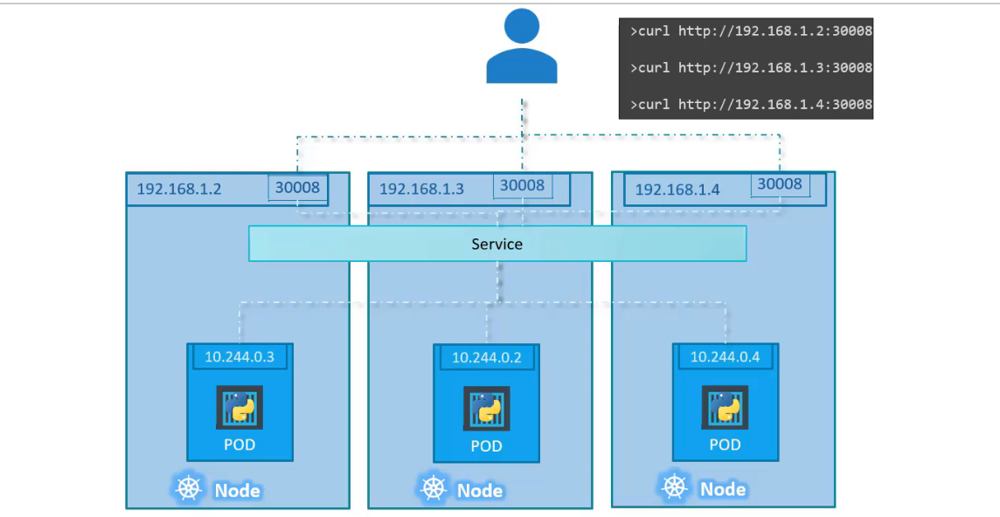
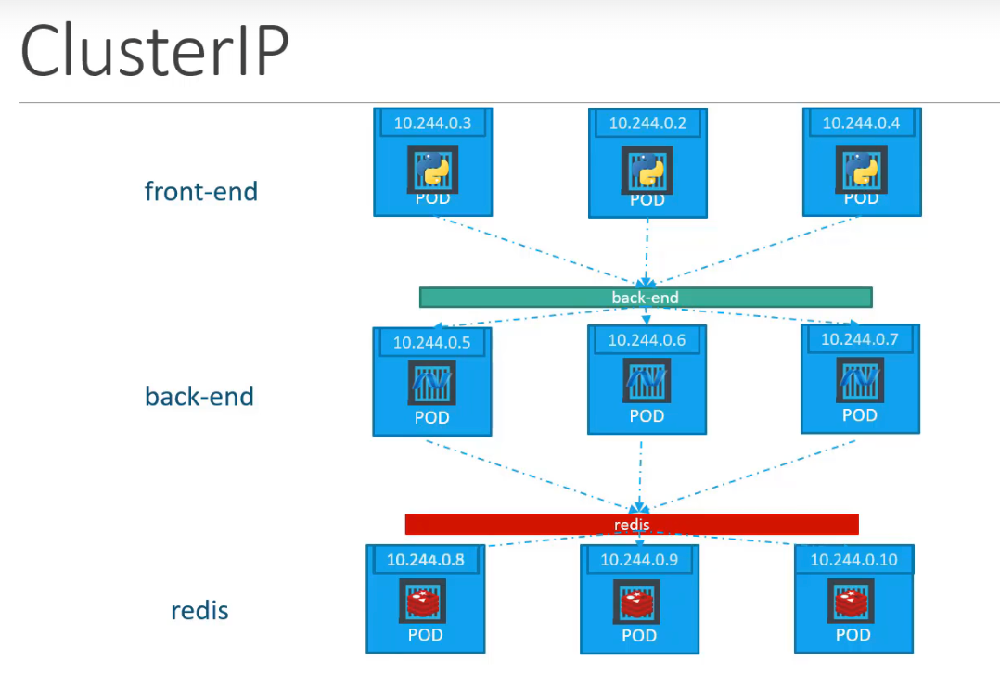

  Kubernetes Services facilitate communication both within the application and with external users. They connect different groups of Pods—such as frontend, backend, and those interacting with external data sources—allowing them to work together seamlessly. Services ensure the frontend is accessible to users, enable backend-frontend interaction, and support connections to external systems. This allows for loose coupling between microservices, making the application more modular and scalable.




## Kubernetes offers three main types of Services for exposing applications



## **Node Port Service**
Exposes a Pod on a specific port of the node, making it accessible externally.  
  The Kubernetes Service is an object, just like Pods, ReplicaSets, or Deployments. One of its use cases is to listen to a port on the node and forward requests on that port to a port on the Pod running the web application.  
  This type of Service is known as a *NodePort Service* because it listens on a port on the node and forwards requests to the Pods.

    
  

??? example "Node Port Configuration (Click to Expand)"
      ```yaml
      apiVersion: v1
      kind: Service
      metadata:
        name: myapp
      spec:
        selector:
          app: myapp
        ports:
        - port: <Port>
          targetPort: <Target Port>
      ```

- If the Pods are distributed across multiple nodes
 

To summarize, in any case, whether it be a single Pod on a single node, multiple Pods on a single node, or multiple Pods on multiple nodes, the service is created exactly the same without you having to do any additional steps during the service creation. When Pods are removed or added, the service is automatically updated,
        
----------------------------------------------------------------


## **Cluster IP Service**
Creates a virtual IP within the cluster, allowing internal communication between services like frontend and backend.
 

- Pods in Kubernetes are assigned IP addresses, but these are not static—pods can be recreated at any time, making direct IP-based communication unreliable. For instance, if a frontend pod needs to talk to the backend, how does it know which backend pod to connect to?

- This is where a Kubernetes Service helps. It groups similar pods (like backend pods) under a single stable IP and DNS name, enabling reliable internal communication. The service automatically load balances requests across the pods in the group.

- Similarly, you can create a service for Redis so backend pods can communicate with it reliably. This setup supports scalable microservices, where each layer can grow or change independently without breaking communication.Such a service is called a ClusterIP service, and it's the standard way for pods to talk to each other inside the cluster.

??? example "ClusterIP Service Configuration (Click to Expand)"
    ```yaml
    # service-definition.yml
    apiVersion: v1
    kind: Service
    metadata:
      name: back-end
    spec:
      type: ClusterIP
      ports:
        - targetPort: 80
          port: 80
      selector:
        app: myapp
        type: back-end
    ```

- The targetPort refers to the port on which the backend pod is running (in this case, 80), while the port is the one exposed by the service itself—also set to 80 here. The selector is used to connect the service to the appropriate set of pods.


- In fact, cluster IP is the default type so even if you didn't specify it it will automatically assume the type to be cluster IP.


----------------------------------------------------------------

## **LoadBalancer Service**
 
??? example "Load Balancer Servive Configuration (Click to Expand)"
    ```yaml
    apiVersion: v1
    kind: Service
    metadata:
      name: myapp
    spec:
      type: LoadBalancer
      selector:
        app: myapp
      ports:
        - port: 80
          targetPort: 80
    ```


- To make your application accessible to users, they need a single, consistent URL—like votingapp.com or resultapp.com—instead of dealing with node IPs and ports.

- If you're using a supported cloud platform such as Google Cloud, AWS, or Azure, you can take advantage of their built-in load balancer.
To do this, simply set the service type of your frontend services to LoadBalancer instead of NodePort.

- Keep in mind, this approach only works on platforms that support this feature—GCP, AWS, and Azure are all supported.

----------------------------------------------------------------

## 🔁 Kubernetes Service Types: Comparison

| Service Type     | Description                                                                  | Access Scope              | Use Case                                        |
|------------------|------------------------------------------------------------------------------|---------------------------|-------------------------------------------------|
| **ClusterIP**     | Default service type. Exposes the service on an internal IP within the cluster. | Internal only              | Internal communication between pods/services.   |
| **NodePort**      | Exposes the service on a static port on each node’s IP.                     | Internal + External access via `<NodeIP>:<NodePort>` | Basic external access (e.g., dev/test environments). |
| **LoadBalancer**  | Provisions an external load balancer and exposes the service to the internet. | External (cloud platforms only) | Production-level public access.                |


🧠 When to Use What?

- **ClusterIP**:
Use when services only need to communicate within the cluster (e.g., frontend talks to backend, backend to database).

- **NodePort**:
Use when you need basic external access to a service (for testing or non-production environments). Requires using `<NodeIP>:<NodePort>`.

- **LoadBalancer**:
Use in cloud environments (AWS, GCP, Azure) when you want a public URL/IP for external access. It automatically handles provisioning of a load balancer.
