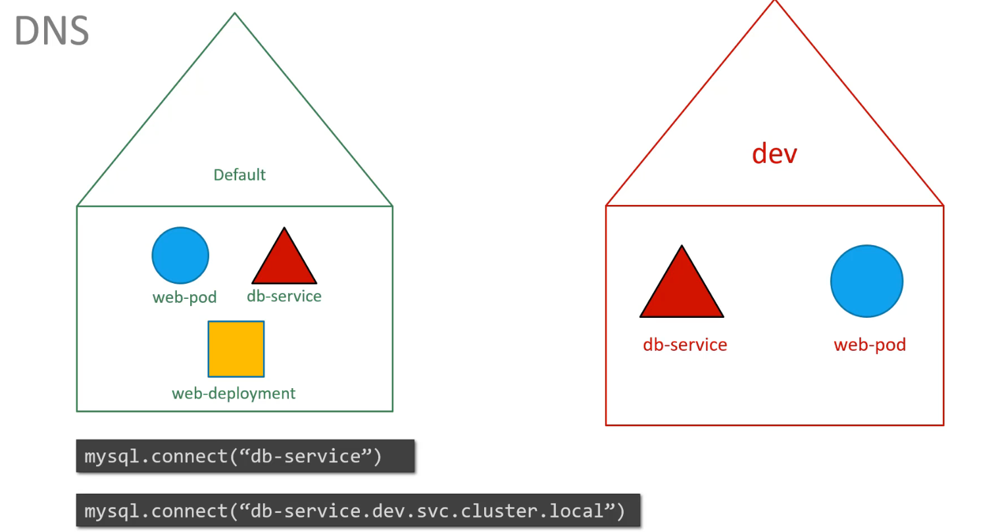
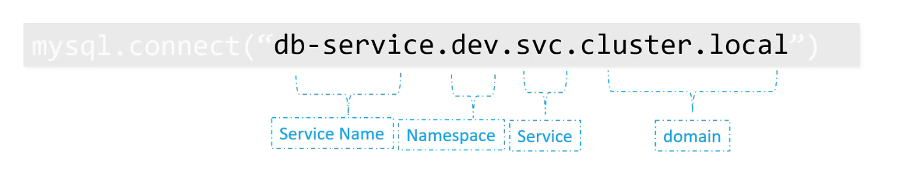
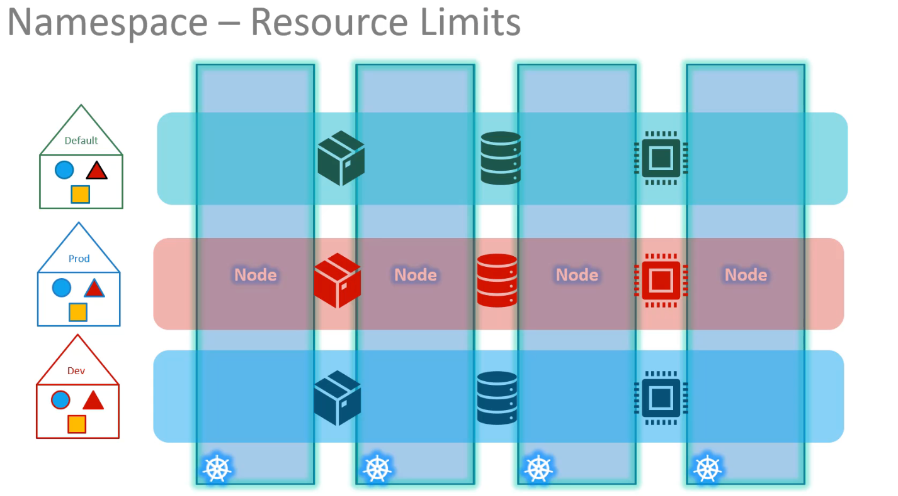

Kubernetes creates three default namespaces at cluster setup:

- **default**: For general user workloads.

- **kube-system**: For internal Kubernetes components (like networking, DNS).

- **kube-public**: For resources accessible to all users.

- While small or learning environments can work within the default namespace, larger or production setups benefit from custom namespaces (e.g., dev, prod) to isolate resources, apply access policies, and manage resource quotas. This helps prevent accidental changes and ensures better organization and control.


- In Kubernetes, resources within the same namespace can communicate using just their names (e.g., a web pod can reach a DB service by using dbservice). To access services across namespaces, use the full DNS format: servicename.namespace.svc.cluster.local (e.g., dbservice.dev.svc.cluster.local). Kubernetes automatically creates these DNS entries, where cluster.local is the default cluster domain and svc indicates it’s a service.




???+ info "NameSpace Commands (Click to Expand)"
    ```sh title="Get Pods in a namespace" linenums="1"
        kubectl get pods --namespace=kube-system

        (OR)

        kubectl get pods --all-namespaces  #getting pods in all namespaces
    ```    

    ```sh title="Create pods in another namespace" linenums="1"
        kubectl create -f pod-definition.yml --namespace=dev
    ```

    ## **Pod Definition with Namespace**

    ??? example "Pod Configuration (Click to Expand)"
        ```yaml
        apiVersion: v1
        kind: Pod
        metadata:
        name: myapp-pod
        namespace: dev
        labels:
            app: myapp
            type: front-end
        spec:
        containers:
            - name: nginx-container
            image: nginx
        ```


    ```sh title="Create Namespace" linenums="1"
        kubectl create namespace dev (OR)
        kubectl create -f namespace-dev.yml

    ```
    ## **Namespace Definition**

    ??? example "Namespace Creation Definition (Click to Expand)"
        ```yaml
        apiVersion: v1
        kind: Namespace
        metadata:
        name: dev
        ```


??? Note "Set Another Namespace As Default  (Click to Expand)"
    - But what if we want to switch to the `dev` namespace permanently, so that we don't have to specify the `--namespace` option anymore?

    ```sh title="Set Default Namespace for kubectl" linenums="1"
    kubectl config set-context $(kubectl config current-context) --namespace=dev
    ```


??? Note "ResourceQuota Configuration (Click to Expand)"
    - To limit resources in a namespace, create a resource quota.

    ```yaml
    apiVersion: v1
    kind: ResourceQuota
    metadata:
      name: compute-quota
      namespace: dev
    spec:
      hard:
        pods: "10"
        requests.cpu: "4"
        requests.memory: 5Gi
        limits.cpu: "10"
        limits.memory: 10Gi
    ```

    
