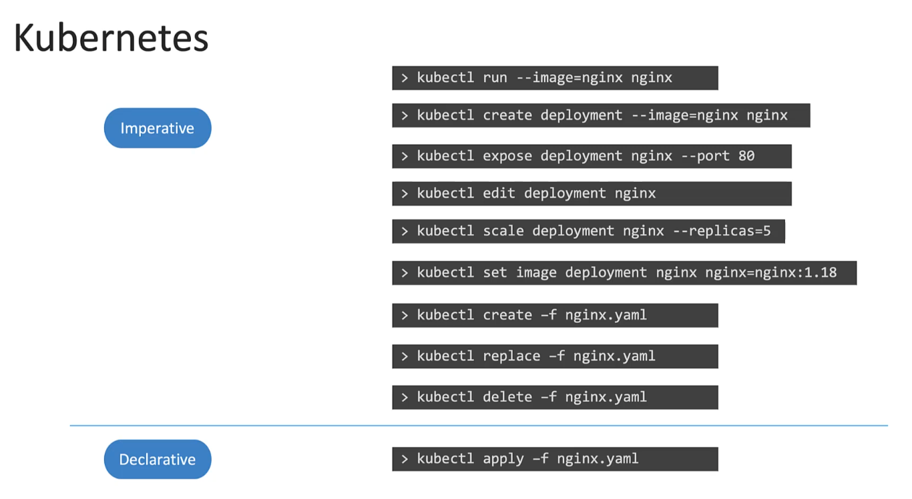
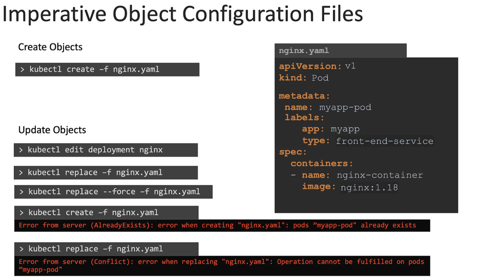
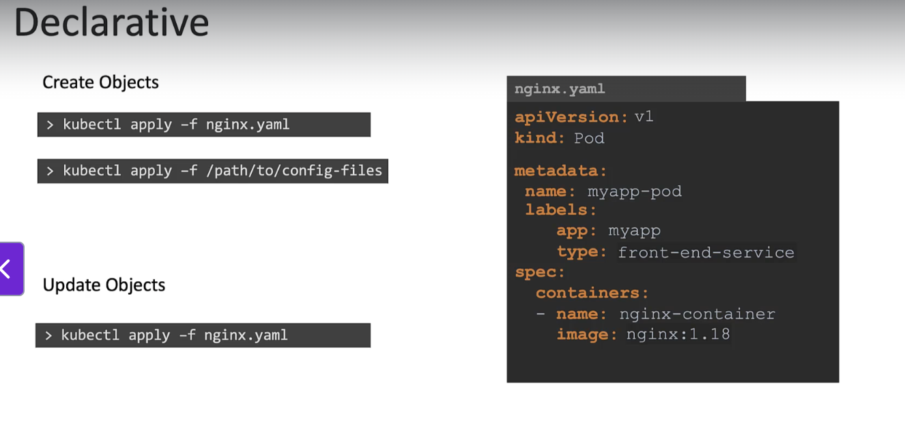

- Note : A more effective approach is to first modify the local copy of the object’s configuration file by updating the image name as needed, and then use the kubectl replace command to apply the changes and update the object.



- The declarative approach involves using the same object configuration files we've been working with. However, instead of using the create or replace commands, we use kubectl apply to manage the objects.

- The kubectl apply command is smart enough to create an object if it doesn’t already exist. When working with multiple configuration files — which is common — you can specify a directory path rather than a single file, allowing all the objects in that directory to be created at once.

- To make changes, simply update the relevant configuration file and run kubectl apply again. If the object already exists, apply will detect that and only apply the necessary updates.

- This approach avoids errors about objects already existing or updates being invalid — kubectl apply automatically figures out the correct way to update the object based on the changes you've made.


## Certification Tips – Imperative Commands with Kubectl

While you will mostly use the **declarative approach** with definition files, **imperative commands** are useful for quickly completing one-time tasks or generating YAML templates. This can save significant time during certification exams.

---

### 🔧 Key Options

- `--dry-run=client`  
  Prevents the resource from being created. Useful for testing commands without making changes.

- `-o yaml`  
  Outputs the object definition in YAML format.

💡 **Tip:** Use both options together to generate definition files you can edit and apply later.

---

## 🐳 POD

### Create an NGINX Pod

```bash
kubectl run nginx --image=nginx
```

### Generate POD YAML Manifest (dry-run)

```bash
kubectl run nginx --image=nginx --dry-run=client -o yaml
```

---

## 🚀 Deployment

### Create a Deployment

```bash
kubectl create deployment --image=nginx nginx
```

### Generate Deployment YAML (dry-run)

```bash
kubectl create deployment --image=nginx nginx --dry-run=client -o yaml
```

### Create Deployment with 4 Replicas

```bash
kubectl create deployment nginx --image=nginx --replicas=4
```

### Scale a Deployment

```bash
kubectl scale deployment nginx --replicas=4
```

### Generate and Save Deployment YAML to File

```bash
kubectl create deployment nginx --image=nginx --dry-run=client -o yaml > nginx-deployment.yaml
```

Then, update the YAML file to add replicas or modify other fields before applying.

---

## 🌐 Service

### Create ClusterIP Service for Pod `redis` on Port 6379

```bash
kubectl expose pod redis --port=6379 --name redis-service --dry-run=client -o yaml
```

> ✅ Automatically uses the pod's labels as selectors.

### Alternative: Create ClusterIP Service (Manual Selectors Required)

```bash
kubectl create service clusterip redis --tcp=6379:6379 --dry-run=client -o yaml
```

> ⚠️ Does not use pod labels. Assumes `app=redis` as selector.

---

### Create NodePort Service for Pod `nginx` Exposing Port 80 on NodePort 30080

```bash
kubectl expose pod nginx --type=NodePort --port=80 --name=nginx-service --dry-run=client -o yaml
```

> ✅ Uses pod's labels as selectors  
> ⚠️ You **cannot specify** the nodePort in this command — must edit YAML manually

### Alternative: Specify NodePort (Manual Selectors Required)

```bash
kubectl create service nodeport nginx --tcp=80:80 --node-port=30080 --dry-run=client -o yaml
```

> ⚠️ Does **not** use pod's labels as selectors

### ✅ Recommendation

Use `kubectl expose` to generate the YAML and **manually add the `nodePort`** before applying it.

---

## 📚 References

- [kubectl Command Reference](https://kubernetes.io/docs/reference/generated/kubectl/kubectl-commands)  
- [kubectl Conventions](https://kubernetes.io/docs/reference/kubectl/conventions/)
