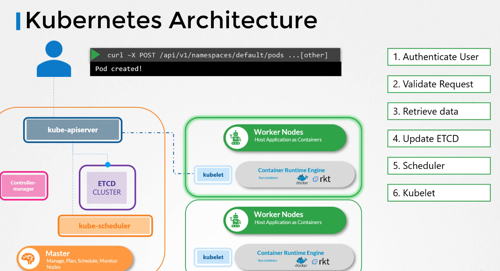

### Kubernetes Components


??? abstract "1. ETCD (Click to Expand)"
    ## ETCD
  
    - The etcd key value data store stores information regarding the cluster such as the nodes, pods, convicts, secrets, accounts, roles,role bindings, and others. Every information you see when you run the kube control get command is from the etcd server.


    - Every change you make to your cluster such as adding additional nodes, deploying pods or replica sets are updated in the etcd server. Only once it is updated in the etcd server is the change considered to be complete.
    
    


    - ETCD V3 Commands
    

    - If you set up your cluster using kubeadm, then kubeadm deploys the etcd server for you as a pod in the kube system namespace.
    

    - In a high availability(HA) environment, you will have multiple master nodes in your cluster. Then you will have multiple etcd instances spread across the master nodes. In that case, make sure that the etcd instances know about each other by setting the right parameter in the etcd service configuration.

--------------------------------------------------------------------------------------

??? abstract "2.Kube-Api Server  (Click to Expand)"
    ## Kube-Api Server

    - Let's look at an example of creating a pod. When you do that, as before,the request is authenticated first and then validated. In this case, the API server creates a pod object without assigning it to a node.Updates the information in the etcd server,updates the user that the pod has been created.

    - The scheduler continuously monitors the API server and realizes that there is a new pod with no node assigned.The scheduler identifies the right worker node
    to place the new pod on. The API server then updates the informationin the etcd cluster.The API server then passes that information to the kubelet in the appropriate worker node.The kubelet then creates the podon the node and instructs the container runtime engineto deploy the application image.Once done, the kubelet updates the statusback to the API serverand the API server then updates the databack in the etcd cluster. A similar pattern is followed every time a change is requested. The kube-apiserver is at the center of all the different tasks that needs to be performed to make a change in the cluster.

    - To summarize, the kube-apiserver is responsible for authenticating and validating requests, retrieving and updating data in the etcd data store. In fact, kube-apiserver is the only component that interacts directly with the etcd data store. The other components, such as the scheduler, kube-controller-manager and kubelet uses the API server to perform updates in the cluster in their respective areas.

    

--------------------------------------------------------------------------------------

??? abstract "3.Kube Controller Manager  (Click to Expand)"
    ## Kube Controller Manager
    
    - A controller is a process that continuously monitors the state of various components within the system and works towards bringing the whole system to the desired functioning state.
  
    - For example, the node controller is responsible for monitoring the status of the nodes and taking necessary actions to keep the applications running. It does that through the Kube API server. The node controller tests the status of the nodes every five seconds. That way the node controller can monitor the health of the nodes. If it stops receiving heartbeat from a node the node is marked as unreachable but it waits for 40 seconds before marking it unreachable. After a node is marked unreachable it gives it 5 minutes to come back up. If it doesn't, it removes the PODs assigned to that node and provisions them on the healthy ones.
    


    -  if the PODs are part of a replica set. The next controller is the replication controller. It is responsible for monitoring the status of replica sets and ensuring that the desired number of PODs are available at all times within the set. If a POD dies, it creates another one. Now, those were just two examples of controllers. There are many more such controllers available within Kubernetes.
    

    - Now, how do you see these controllers and where are they located in your cluster? They're all packaged into a single process known as the Kubernetes Controller Manager. When you install the Kubernetes controller manager the different controllers get installed as well.

    

--------------------------------------------------------------------------------------

??? abstract "4.kube-scheduler (Click to Expand)"
    ## kube-scheduler
    - ####Note: Remember, the scheduler is only responsiblefor deciding which pod goes on which node.It doesn't actually place the pod on the nodes.That's the job of the kubelet.

    - The scheduler looks at each pod and tries to find the best node for it.For example, let's take one of these pods, the big blue one.It has a set of CPU and memory requirements.The scheduler goes through two phasesto identify the best node for the pod.In the first phase, the scheduler tries to filter outthe nodes that do not fit the profile for this pod.For example, the nodes that do not have sufficient CPU and memory resources requested by the pod.So the first two small nodes are filtered out.So we are now left with the two nodeson which the pod can be placed.Now how does the scheduler pick one from the two?The scheduler ranks the nodesto identify the best fit for the pod.It uses a priority function to assign a scoreto the nodes on a scale of zero to 10.For example, the scheduler calculatesthe amount of resources that would be freeon the nodes after placing the pod on them.In this case, the one on the rightwould have six CPUs free if the pod was placed on it,which is four more than the other one.So it gets a better rank, and so it wins.
    


--------------------------------------------------------------------------------------

??? abstract "5.kubelet (Click to Expand)"
    ## kubelet
    - The kubelet in the Kubernetes worker node registers the node with a Kubernetes cluster. When it receives instructions to load container or a pod on the node,it requests the container runtime engine,which may be Docker, to pull the required image and run an instance.The kubelet then continues to monitor the state of the pod and containers in it and reports to the kube API serveron a timely basis.
  
    - #### Note: So how do you install the kubelet? If you use the kubeadm tool to deploy your cluster,it does not automatically deploy the kubelet. Now that's the difference from other components.You must always manually install the kubelet on your worker nodes.


--------------------------------------------------------------------------------------
??? abstract "6.kube-proxy (Click to Expand)"
    ##  kube-proxy (networking and Communication)
    - Kube-proxy is a process that runs on each node in the Kubernetes cluster. Its job is to look for new services, and every time a new service is created, it creates the appropriate rules on each node to forward traffic to those services to the backend pods. One way it does this is using iptables rules. In this case, it creates an iptables rule on each node in the cluster to forward traffic heading to the IP of the service, which is 10.96.0.12, to the IP of the actual pod, which is 10.32.0.15. So that's how kube-proxy configures a service.
    

    - The kubeadm tool deploys kube-proxy as pods on each node. In fact, **it is deployed as a DaemonSet**, so a single pod is always deployed on each node in the cluster.
    


--------------------------------------------------------------------------------------

??? abstract "7.Pods (Click to Expand)"
    ## Pods

    - A pod is a single instance of an application. A pod is the smallest object that you can create in Kubernetes. Here we see the simplest of simplest cases where you have a single-node Kubernetes cluster with a single instance of your application running in a single Docker container encapsulated in a pod.
    
    - What if the number of users accessing your application increase and you need to scale your application? We create a new pod altogether with a new instance of the same application. As you can see, we now have two instances of our web application running on two separate pods on the same Kubernetes system or node.
    
    
    
    - What if the user base further increases and your current node has no sufficient capacity? Well, then you can always deploy additional pods on a new node in the cluster.

    - You will have a new node added to the cluster to expand the cluster's physical capacity. Pods usually have a one-to-one relationship with containers running your application. To scale up, you create new pods, and to scale down, you delete existing pods. You do not add additional containers to an existing pod to scale your application.

    

    - So in the current state, we haven't made the web server accessible to external users. You can, however, access it internally from the node. Once we learn about networking and services, we will get to know how to make this service accessible to end users.

    ???+ example "Pod Configuration in YAML (Click to Expand)"
        ```yaml
        apiVersion: v1
        kind: Pod
        metadata:
          name: myapp-pod
          labels:
            app: myapp            # Label 1
            type: backend-process # Label 2
        spec:
          containers:
            - name: myapp-container
              image: <Image>
              resources:
                limits:
                  memory: "128Mi"
                  cpu: "500m"
              ports:
                - containerPort: 8080
        ```
    
    

    - Containers is a list or an array. The reason this property is a list is because the pods can have multiple containers within them
  
    
    ???+ info "Commands to Create Pod and describe pod (Click to Expand)"
        ```sh title="pod-definition.yaml" linenums="1"
        kubectl create -f pod-definition.yaml
        ```

        ```sh title="To Get Pods" linenums="1"
        kubectl get pods
        ```

        ```sh title="To Describe Pods" linenums="1"
        kubectl describe pod myapp-pod
        ```
--------------------------------------------------------------------------------------

??? abstract "8. ReplicaSets (Click to Expand)"
    ## ReplicaSets
    