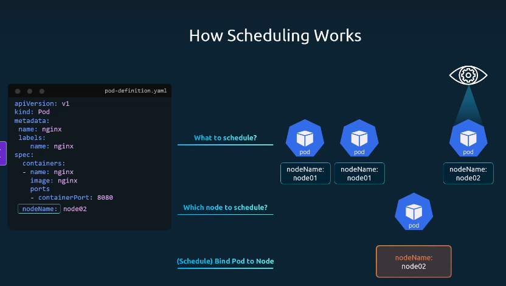

??? quote "Credits"
    This documentation is based on the [Certified Kubernetes Administrator (CKA) with Practice Tests](https://www.udemy.com/course/certified-kubernetes-administrator-with-practice-tests/?couponCode=MT250929G3) Udemy course by **Mumshad Mannambeth**, with supporting labs from [KodeKloud](https://kodekloud.com/).


### Working of Scheduler in Kubernetes



- Each pod has a `nodeName` field, which is empty by default.  
- You usually don’t set this field in the manifest—Kubernetes sets it automatically.  
- The scheduler looks for pods without a `nodeName`.  
- It runs its algorithm to find a suitable node.  
- Once identified, it schedules the pod by setting `nodeName` through a binding object.  

---

# Scheduling Without a Scheduler


If there is no scheduler, pods will remain in the **Pending** state.  
You can still assign them manually in two ways:

| Case | How it Works | Notes |
|------|--------------|-------|
| **During Pod Creation** | Set the `nodeName` field in the pod spec before creating the pod. Kubernetes then assigns the pod to that node. | • Only possible at creation time.<br>• Simple and direct method. |
| **After Pod Creation** | Create a **Binding object** and send a **POST request** to the Pods Binding API, specifying the target node in JSON format. | • `nodeName` cannot be modified after creation.<br>• Mimics the scheduler’s binding process.<br>• Requires YAML → JSON conversion. |


--- 

# Troubleshooting Pods in Pending State

If a pod is stuck in the **Pending** state, use the following checklist:

| Area | What to Check | Command(s) |
|------|---------------|------------|
| **Pod Events and Description** | Review events for scheduling errors or resource issues (CPU, memory, storage). | ``` kubectl describe pod <pod-name> ``` |
| **Node Status** | Ensure nodes are Ready and have enough free CPU, memory, and disk space. | ``` kubectl get nodes ```<br><br>``` kubectl describe node <node-name> ``` |
| **Scheduler Availability** | Verify kube-scheduler is running. If it’s down, pods will remain Pending. | *(Check scheduler pod logs in managed clusters)* |
| **Resource Requests and Limits** | Confirm pod `resources.requests` don’t exceed node capacity. Compare with available resources. | *(Check pod spec and node resources with `kubectl describe`)* |
| **Taints and Tolerations** | Check if nodes have taints; pods need matching tolerations. | ``` kubectl describe node <node-name> \| grep Taints ``` |
| **Node Selectors and Affinity** | Validate scheduling rules like `nodeSelector`, `nodeAffinity`, or `podAffinity`/`podAntiAffinity`. | *(Check pod spec YAML)* |
| **Persistent Volumes and Claims** | Ensure PVCs are bound and a matching PV exists. | ``` kubectl get pvc ``` |

---

## ✅ Quick Reference
1. Check **Pod Events** → `kubectl describe pod`.  
2. Check **Nodes** → `kubectl get nodes` → `kubectl describe node`.  
3. Confirm **Scheduler** is running.  
4. Validate **Resource Requests/Limits**.  
5. Inspect **Taints/Tolerations**.  
6. Review **Node Selectors / Affinity rules**.  
7. Verify **PVCs and PVs**.  
