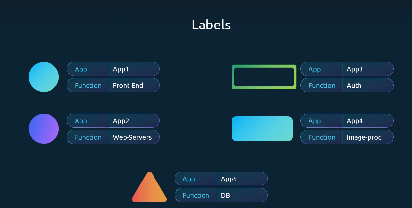
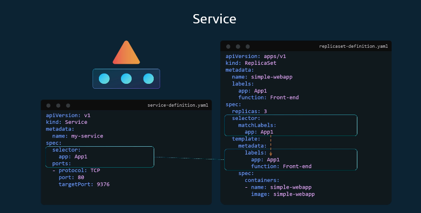

- For example, here's a manifest for a Pod that has two labels environment: production and app: nginx:
  
???+ example "Pod Labels Configuration in YAML (Click to Expand)"
    ```yaml
    apiVersion: v1
    kind: Pod
    metadata:
      name: label-demo
      labels:
        environment: production  # Label 1
        app: nginx               # Label 2
    spec:
      containers:
        - name: nginx
          image: nginx:1.14.2
          ports:
            - containerPort: 80
    ```

```sh title="Select Pods using a Label Selector" linenums="1"
kubectl get pods --selector app=nginx (or)
kubectl get pods -l env=prod,bu=finance,tier=frontend #if Pods have multiple labels

🔎 Explanation:
-l (or --selector) lets you filter by labels.
Comma-separated labels mean AND condition → Pod must match all of them.

```

---


## Annotation
- Labels and selectors are primarily used to group and identify Kubernetes objects, whereas annotations serve to store additional information for reference.

- For instance, annotations can capture details such as tool name, version, build information, and other metadata.


???+ example "Pod with Annotation in YAML (Click to Expand)"
    ```yaml
    apiVersion: v1
    kind: Pod
    metadata:
      name: annotations-demo
      annotations:
        imageregistry: "https://hub.docker.com/"  # Annotation
    spec:
      containers:
        - name: nginx
          image: nginx:1.14.2
          ports:
            - containerPort: 80
    ```
