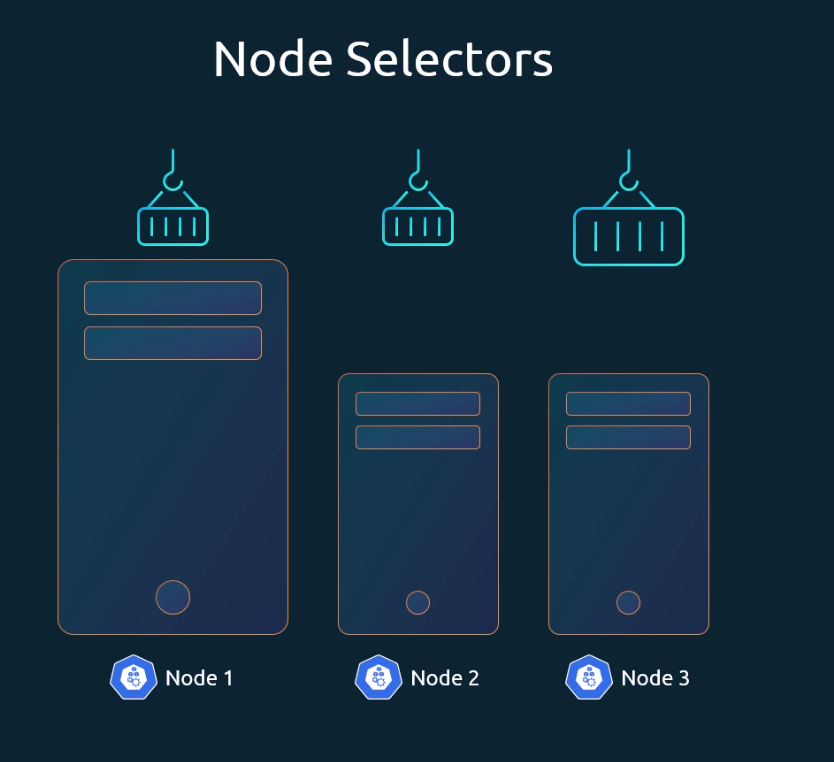
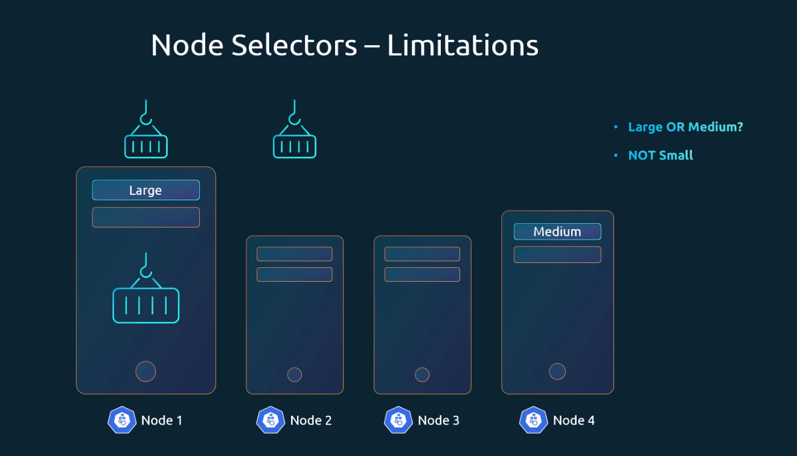

- Cluster has **3 nodes**: 2 small (limited resources) and 1 large (higher capacity).  
- Heavy **data-processing jobs** should run on the large node.  
- By default, Kubernetes can schedule pods on **any node**.  
- This may place heavy pods on small nodes, which is not desired.  
- To avoid this, restrict pods to specific nodes using **node selectors** (simplest method).  


---
## NodeSelector Example

!!! important
    - Nodes are labeled with key-value pairs (e.g., `size=large`).  
    - The scheduler uses these labels to decide where to place pods.  
    - Nodes must be labeled **before** using them in a `nodeSelector`.  

```sh title="Node Labeling Command"
kubectl label nodes <node-name> <label-key>=<label-value>
# Example: kubectl label nodes node-1 size=Large
```


??? example "Pod Configuration with NodeSelector (Click to Expand)"
    ```yaml
    apiVersion: v1
    kind: Pod
    metadata:
      name: myapp-pod
    spec:
      containers:
        - name: data-processor
          image: data-processor
      nodeSelector:
        size: Large
    ```


- In the pod definition file, you can add a `nodeSelector` under the `spec` section with `size: large` to ensure the data-processing pod runs only on the larger node.  

- This works because nodes are assigned labels (e.g., `size=large`), and the Kubernetes scheduler matches these labels with the node selector to decide where the pod should run.

 
  ---
## Node Selector Limitations


- NodeSelector works for **simple cases** with a single label.  
- Complex rules (e.g., run on `large OR medium` nodes, or avoid `small` nodes) are **not possible** with NodeSelector.  
- For such scenarios, use **Node Affinity** and **Anti-Affinity**.  
