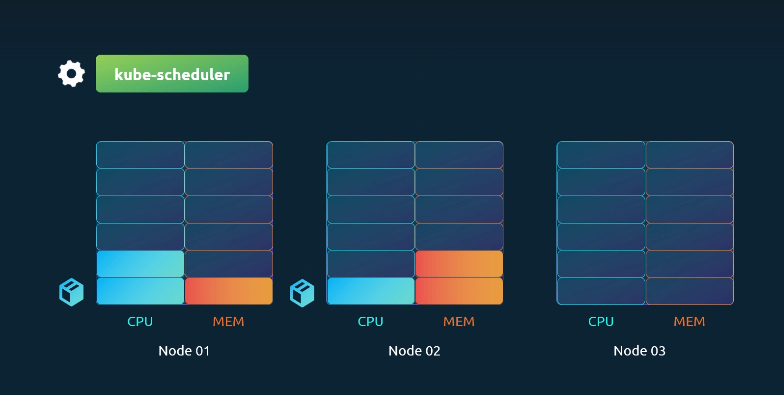

In a Kubernetes cluster, each node has limited CPU and memory resources. Every pod requests specific resources, and when scheduled, it consumes them from the assigned node.  

The **Kubernetes Scheduler** decides where a pod runs:

- It checks if a node has enough free resources to host the pod.  
- If a node has insufficient resources, the scheduler skips it.  
- If no node can host the pod, the pod remains in a **Pending** state.  




You can verify this using:

```bash
kubectl describe pod <pod-name>
```

---

# Kubernetes Resource Units
A single CPU unit in Kubernetes can represent:

- **1 AWS vCPU**
- **1 GCP Core**
- **1 Azure Core**
- **1 Hyperthread**

You can request fractional CPUs as well:

- `0.1` CPU = **100m** (milliCPU)
- Minimum granularity is **1m**.
- Example: `cpu: 5` means the container requests **5 vCPUs** (if nodes have enough capacity).

### CPU Table

| Unit | Equivalent |
|------|-------------|
| 1 CPU | 1 AWS vCPU / 1 GCP Core / 1 Azure Core / 1 Hyperthread |
| 0.1 CPU | 100 milliCPU (m) |
| 1m CPU | Smallest allocatable unit |

---

## Memory Resources

Memory can be expressed using different suffixes. By default, a container has **no limit** and can consume all available memory on a node — potentially starving other processes.  
You can prevent this by **setting memory limits**.

### Memory Table

| Unit | Equivalent |
|------|-------------|
| 1G (Gigabyte) | 1,000,000,000 bytes |
| 1M (Megabyte) | 1,000,000 bytes |
| 1K (Kilobyte) | 1,000 bytes |
| 1Gi (Gibibyte) | 1,073,741,824 bytes |
| 1Mi (Mebibyte) | 1,048,576 bytes |
| 1Ki (Kibibyte) | 1,024 bytes |

### Example

- `memory: 256Mi` → 256 Mebibytes  
- `memory: 1G` → 1,000 MB  
- `memory: 1Gi` → 1,024 MB  

---

## Resource Limits

- By default, containers can consume unlimited CPU/Memory from a node.  
- **Requests** are the minimum guaranteed resources for a container.  
   - `cpu: 2` → Scheduler guarantees 2 vCPUs.  
   - `memory: 1Gi` → Scheduler guarantees 1 GiB of memory.  

- **Limits** are the maximum resources a container can use.  
  - `cpu: 2` → Container cannot exceed 2 vCPUs.  
  - `memory: 2Gi` → Container cannot exceed 2 GiB of memory.  

???+ example "Pod Resource Requests and Limits in YAML (Click to Expand)"
    ```yaml
    apiVersion: v1
    kind: Pod
    metadata:
      name: simple-webapp-color
      labels:
        name: simple-webapp-color
    spec:
      containers:
        - name: simple-webapp-color
          image: simple-webapp-color
          ports:
            - containerPort: 8080
          resources:
            requests:
              memory: "1Gi"
              cpu: 2
            limits:
              memory: "2Gi"
              cpu: 2
    ```

---

## What Happens When a Pod Exceeds Its Limits?

- **CPU**:  
  If a pod tries to use more CPU than its limit, the system will throttle it.  
  The container cannot exceed the defined CPU limit.

- **Memory**:  
  Memory works differently. A container can attempt to use more memory than its limit,  
  but if it consistently exceeds that value, the pod will be **terminated**.  
  You’ll see the termination reason as **OOMKilled (Out of Memory)** in logs or in  
  the output of `kubectl describe pod`.

---

# Behavior of CPU Requests and Limits

By default, Kubernetes does **not** define CPU or memory requests or limits.  
This means any pod can consume as many resources as it wants, potentially starving other pods or system processes.  
Let’s examine different scenarios with two pods competing for CPU:
## CPU Requests and Limits Behavior

| Scenario                 | Requests | Limits | Behavior                                                                 | Notes / Best Practice |
|--------------------------|----------|--------|--------------------------------------------------------------------------|-----------------------|
| **1. No Requests, No Limits** | ❌ None   | ❌ None | Pods can consume unlimited CPU. One pod may take all resources and starve others. | ⚠️ Not recommended |
| **2. No Requests, With Limits** | ❌ None   | ✅ Set  | Kubernetes assumes **requests = limits**. Example: if limit = 3 vCPUs, pod gets exactly 3 vCPUs. | Can waste CPU if other pods are idle |
| **3. Requests + Limits** | ✅ Set   | ✅ Set | Pod is guaranteed requests (e.g., 1 vCPU) and can scale up to the defined limit (e.g., 3 vCPUs). | Fair, but can block a pod from using extra unused CPU |
| **4. Requests Only (No Limits)** | ✅ Set   | ❌ None | Each pod gets guaranteed CPU (e.g., 1 vCPU) but can use more if available. Other pods are still guaranteed their requests. | ✅ Recommended setup (flexible + fair) |

---

### Key Notes
- By default, Kubernetes sets **no requests and no limits**.  
- Always define **requests** to guarantee minimum resources for each pod.  
- Use **limits** only when you need to strictly control resource usage (e.g., shared/public clusters).  


---

## When to Use Limits
- In some environments (e.g., shared clusters or public labs), **limits are required** to prevent misuse.  
  Example: restricting containers from excessive workloads like crypto mining.  
- For applications you control, consider setting **requests** but leaving **limits unset** for better resource utilization.  
- Always ensure every pod has **requests** defined — otherwise, it risks being starved when competing pods consume all available resources.

---

# Behavior of Memory Requests and Limits

Unlike CPU (which can be throttled), **memory cannot be throttled**.  
If a pod exceeds its memory limit, it is killed (**OOMKilled**) and restarted.  

| Scenario                       | Requests | Limits | Behavior                                                                 | Notes |
|--------------------------------|----------|--------|--------------------------------------------------------------------------|-------|
| **1. No Requests, No Limits**  | ❌ None  | ❌ None | One pod can consume all memory and starve others.                        | ⚠️ Not recommended |
| **2. No Requests, With Limits**| ❌ None  | ✅ Set  | Kubernetes assumes **requests = limits**. Example: 3Gi request & limit.  | Guarantees memory but can waste unused capacity |
| **3. Requests + Limits**       | ✅ Set   | ✅ Set  | Example: `requests = 1Gi`, `limits = 3Gi`. Pod is guaranteed 1Gi and capped at 3Gi. | Fair sharing, but strict cap may block efficient usage |
| **4. Requests Only (No Limits)**| ✅ Set  | ❌ None | Example: `requests = 1Gi`, no limits. Pod can use all available memory. If it exceeds node capacity, it will be **killed**. | ✅ Useful for flexibility, but risky since OOMKill occurs |


---

## Default Resource Policies (LimitRanges)

- By default, pods have **no requests or limits**.  
To enforce defaults at the **namespace level**, Kubernetes provides **LimitRanges**.

- A `LimitRange` object defines:
  **default requests/limits** (applied if not set in pod spec)

???+ example "CPU LimitRange (Click to Expand)"
    ```yaml
    apiVersion: v1
    kind: LimitRange
    metadata:
      name: cpu-resource-constraint
    spec:
      limits:
        - default:
            cpu: 500m
          defaultRequest:
            cpu: 500m
          max:
            cpu: "1"
          min:
            cpu: 100m
          type: Container
    ```

???+ example "Memory LimitRange (Click to Expand)"
    ```yaml
    apiVersion: v1
    kind: LimitRange
    metadata:
      name: memory-resource-constraint
    spec:
      limits:
        - default:
            memory: 1Gi
          defaultRequest:
            memory: 1Gi
          max:
            memory: 1Gi
          min:
            memory: 500Mi
          type: Container
    ```


## LimitRange Explanation

| Field            | CPU Example                  | Memory Example               | Meaning                                                                 |
|------------------|------------------------------|------------------------------|-------------------------------------------------------------------------|
| **default**      | `500m`                       | `1Gi`                        | Default limit if none is specified in the pod/container spec             |
| **defaultRequest** | `500m`                     | `1Gi`                        | Default request if none is specified in the pod/container spec           |
| **max**          | `1` (1 vCPU)                 | `1Gi`                        | Maximum value a container can request                                   |
| **min**          | `100m` (0.1 vCPU)            | `500Mi`                      | Minimum value a container must request                                  |
| **type**         | `Container`                  | `Container`                  | Applies the LimitRange at the **container level**                       |


### Key Notes
- **LimitRange** applies at the **namespace** level.  
- It only affects **newly created pods** (existing pods are unaffected).  
- Ensures fair resource allocation and prevents abuse (e.g., setting extremely high requests).  
- Values shown here are **examples**, not strict recommendations — adjust based on your application needs.  

---

## Resource Quotas in Kubernetes

To restrict the **total amount of resources** consumed by applications in a Kubernetes cluster,  you can define **ResourceQuotas** at the **namespace level**.  

A **ResourceQuota** sets hard limits on the total amount of CPU and memory that all pods in a namespace can request or consume.  

### Example Explanation
- **requests.cpu: 4** → All pods in this namespace together can request up to **4 CPUs**.  
- **requests.memory: 4Gi** → All pods can request up to **4 GiB** of memory.  
- **limits.cpu: 10** → Maximum CPU usage across all pods is **10 CPUs**.  
- **limits.memory: 10Gi** → Maximum memory usage across all pods is **10 GiB**.  

---

???+ example "ResourceQuota Example in YAML (Click to Expand)"
    ```yaml
    apiVersion: v1
    kind: ResourceQuota
    metadata:
      name: my-resource-quota
    spec:
      hard:
        requests.cpu: 4
        requests.memory: 4Gi
        limits.cpu: 10
        limits.memory: 10Gi
    ```


