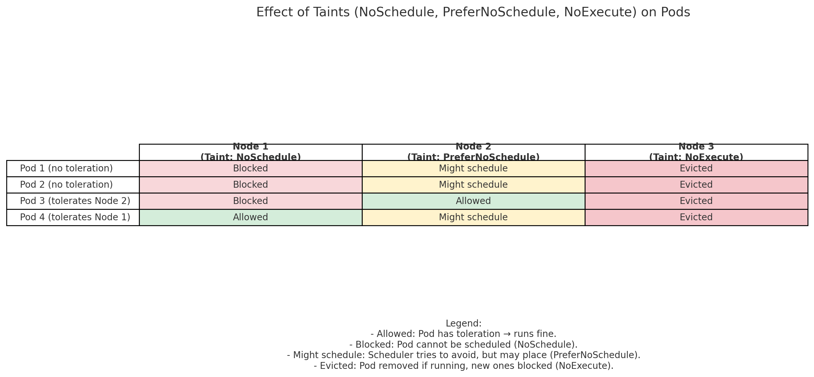

**Taint (on Node):** says *“don’t accept certain Pods unless they have permission.”*  
**Toleration (on Pod):** is that *permission* which allows the Pod to run on a tainted Node.  

!!! tip "Key Point"
    - **Taints** keep Pods away from Nodes.  
    - **Tolerations** let Pods through, but don’t force them onto that Node.  
    - To **force** Pods onto specific Nodes, use **Node Affinity**.  
    - Remember: **Taints are set on Nodes** and **Tolerations are set on Pods**.  

---

## Taint Effects

Taints can have 3 different effects:

- **NoSchedule** → Pod without toleration will not be scheduled on the node.  
- **PreferNoSchedule** → Kubernetes tries not to schedule Pods without toleration, but may still do so if needed.  
- **NoExecute** → Pod without toleration will be evicted if it’s already running, and new Pods without toleration won’t be scheduled.  

---

## Example

We now have 3 nodes, each with a different taint effect:

### Nodes & Their Taints
- **Node 1 – NoSchedule** 👉 Pod without toleration ❌ won’t be scheduled.  
- **Node 2 – PreferNoSchedule** 👉 Pod ⚠️ might still be scheduled if no better option.  
- **Node 3 – NoExecute** 👉 Pod ⛔ is evicted if already running, and new ones are blocked.  

### Pods in This Scenario
- **Pod 1** → no toleration  
- **Pod 2** → no toleration  
- **Pod 3** → tolerates Node 2’s taint  
- **Pod 4** → tolerates Node 1’s taint  



---

## Taint Syntax

```sh title="Add a Taint to a Node"
kubectl taint nodes <node-name> <key>=<value>:<effect>
```

## Taint Example 
```sh title="Add a Taint to Node1" linenums="1"
kubectl taint nodes node1 app=blue:NoSchedule
```

## Tolerations example
```yaml title="Tolerations for the pod" linenums="1"
apiVersion: v1
kind: Pod
metadata:
  name: myapp-pod
spec:
  containers:
    - name: nginx-container
      image: nginx
  tolerations:
    - key: "app"
      operator: "Equal"
      value: "blue"
      effect: "NoSchedule"
```
!!! note
    Remember, all of these values inside tolerations need to be encoded in double quotes.

--- 

### Master Node Taints

- Master nodes can technically run Pods like worker nodes, but by default the **scheduler avoids them**.  
This is because a **taint is automatically applied** to master nodes when the cluster is first set up.  

- You can view or modify this taint if needed, but **best practice is not to run application workloads on master nodes**.  

```sh title="Check Taints on Master Node"
kubectl describe node <master-node-name> | grep Taint
```

### Remove a Taint from a Node

- To remove a taint from a node in Kubernetes, you append a `-` at the end of the taint specification.  

- For example, to remove the **NoSchedule** taint from the `controlplane` node, run:  

```sh title="Remove NoSchedule Taint from controlplane" linenums="1"
kubectl taint nodes controlplane node-role.kubernetes.io/control-plane:NoSchedule-
```
