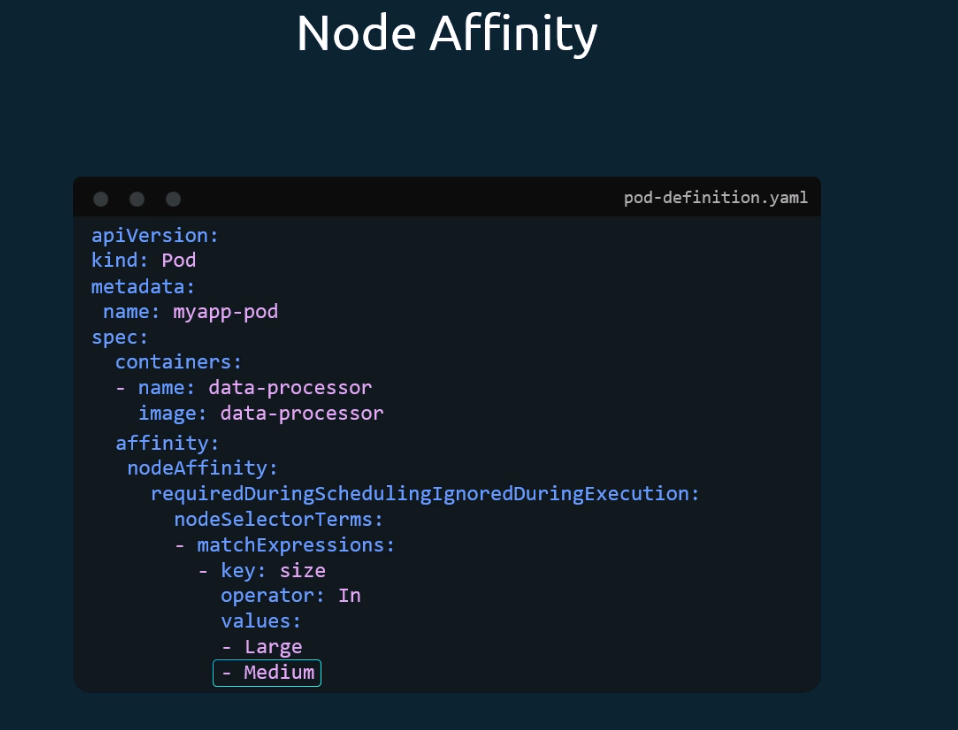
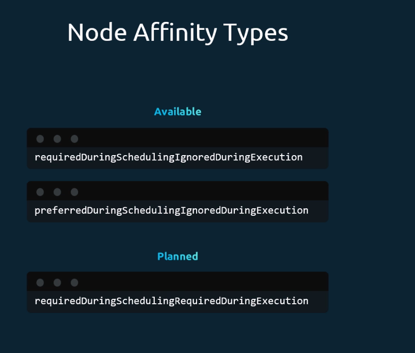
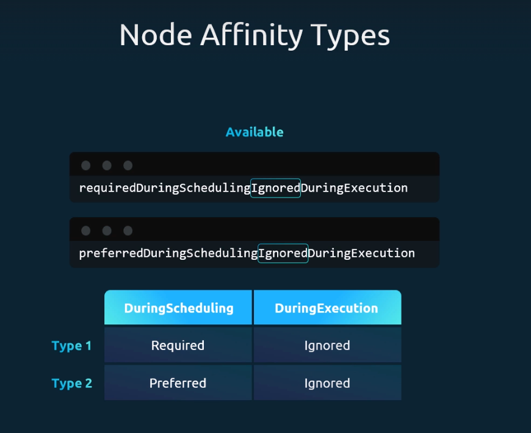

- Node Affinity provides **advanced control** over pod placement compared to NodeSelector.  
- Defined under `spec > affinity > nodeAffinity`.  
- Uses **matchExpressions** with `key`, `operator`, and `values`.  
  - Example: `In`, `NotIn`, `Exists`.  
- Example rules:  
  - Place pod on `Large` or `Medium` nodes.  
  - Avoid scheduling on `Small` nodes.  
  - Match nodes where label `size` exists.  

---

## Node Affinity Types

- **Two stages** in pod lifecycle:  
  - **DuringScheduling** – pod creation.  
  - **DuringExecution** – pod already running.  

- **Available Types**:  
  - `requiredDuringSchedulingIgnoredDuringExecution` → Pod scheduled only if matching node exists.  
  - `preferredDuringSchedulingIgnoredDuringExecution` → Tries matching node, falls back to any node.  

- **Planned Type**:  
  - `requiredDuringSchedulingRequiredDuringExecution` → Will enforce rules even after pod is running.  

---

## Behavior Summary

- **Required**: Pod won’t be scheduled without a matching node.  
- **Preferred**: Scheduler tries to match, but runs pod elsewhere if needed.  
- **Ignored During Execution**: Running pods are **not affected** if labels change later.  

