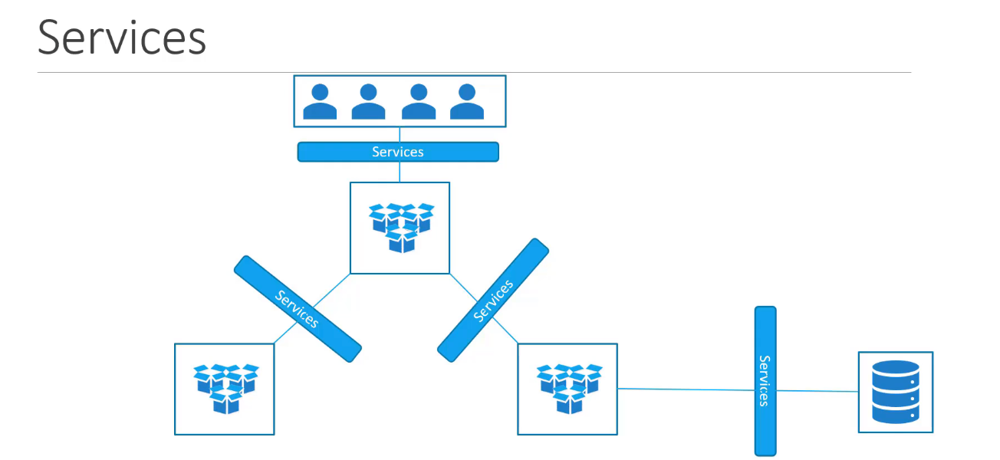
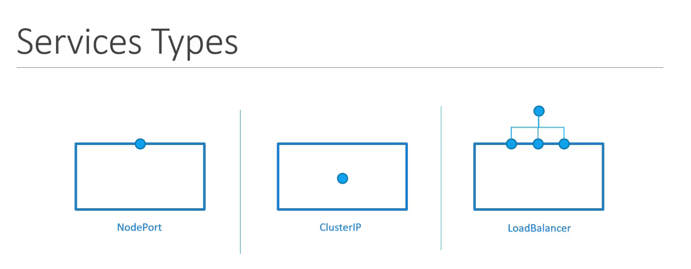

  Kubernetes Services facilitate communication both within the application and with external users. They connect different groups of Pods—such as frontend, backend, and those interacting with external data sources—allowing them to work together seamlessly. Services ensure the frontend is accessible to users, enable backend-frontend interaction, and support connections to external systems. This allows for loose coupling between microservices, making the application more modular and scalable.




## Kubernetes offers three main types of Services for exposing applications



- **NodePort**: Exposes a Pod on a specific port of the node, making it accessible externally.  
  The Kubernetes Service is an object, just like Pods, ReplicaSets, or Deployments. One of its use cases is to listen to a port on the node and forward requests on that port to a port on the Pod running the web application.  
  This type of Service is known as a *NodePort Service* because it listens on a port on the node and forwards requests to the Pods.

    
  

??? example "Node Port Configuration (Click to Expand)"
      ```yaml
      apiVersion: v1
      kind: Service
      metadata:
        name: myapp
      spec:
        selector:
          app: myapp
        ports:
        - port: <Port>
          targetPort: <Target Port>
      ```

- If the Pods are distributed across multiple nodes
 

To summarize, in any case, whether it be a single Pod on a single node, multiple Pods on a single node, or multiple Pods on multiple nodes, the service is created exactly the same without you having to do any additional steps during the service creation. When Pods are removed or added, the service is automatically updated,
        
----------------------------------------------------------------

- **ClusterIP**: Creates a virtual IP within the cluster, allowing internal communication between services like frontend and backend.

- **LoadBalancer**: Provisions an external load balancer (on supported cloud providers) to distribute traffic, such as across multiple frontend web servers.
