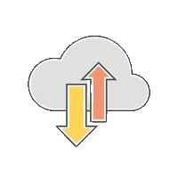

<h1 style="display: flex; align-items: center; gap: 10px;">
  Networking
  
</h1>

[use unseen to remove the gif background](https://www.unscreen.com/upload)

## Commands

`python3 -m venv venv` 
`source venv/bin/active`
- start venv


* `mkdocs new [dir-name]` - Create a new project.
* `mkdocs serve` - Start the live-reloading docs server.
* `mkdocs build` - Build the documentation site.
* `mkdocs -h` - Print help message and exit.

## Project layout

    mkdocs.yml    # The configuration file.
    docs/
        index.md  # The documentation homepage.
        ...       # Other markdown pages, images and other files.


```sh title="create_folder.sh" linenums="1"
mkdir k8s-manifests 
```

``` py title="main.py"  linenums="1"
def main(){}
```

!!! note
    hi

!!! abstract
    hi

!!! info
    hi

!!! tip
    hi

!!! success
    hi

!!! question
    hi

!!! warning
    hi

!!! failure
    hi


!!! failure
    hi


!!! danger
    hi

!!! bug
    hi

!!! example 
    hi

!!! quote
    hi
